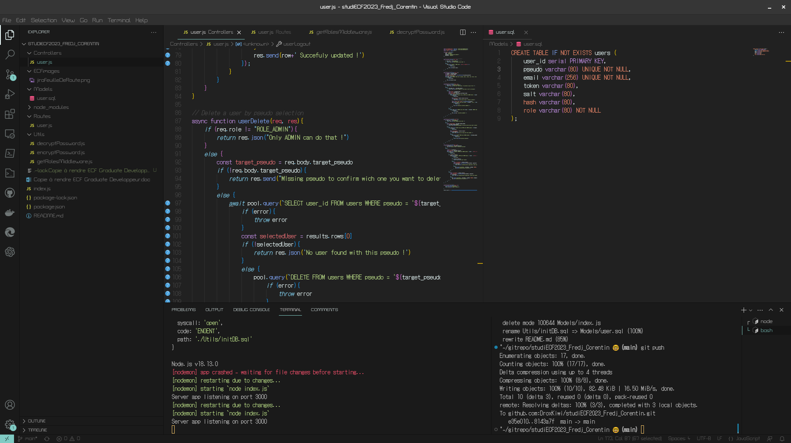
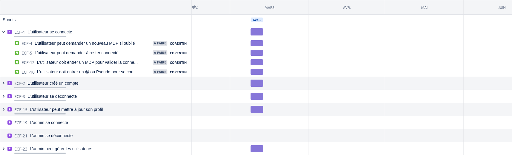

# studiECF2023_Fredj_Corentin

Ceci est le dépôt pour l'ECF Graduate Developper

# Présentation 

Ceci est le rendu ECF pour évaluer les compétences.

## ***Je vous demande s'il vous plaît d'être indulgent ! Veuillez m'excusez par avance .. seulement j'ai codé une application entière (après avoir posé des question sur le forums de STUDI), et 72H avant la date limite de rendu j'ai remqarqué qu'il y avait un annexe avec des consignes précises.. Je ne suis visiblement pas le pinguin le plus glissant de la banquise ..***
___
## Voici le git de mon projet que j'ai codé si vous souhaitez vérifier : https://github.com/DroxKiwi/webappBeWave

## J'ai tout de même décidé de faire l'ECF en suivant les consignes (72h c'est court pour rattraper la boulette) ceci explique le manque de commit pour le début du projet.
___
# **Mettre en place le backoffice en local**

## PostgreSQL 

### **Il faut nécessairement PostgreSQL et NPM sur votre machine !**

### **Le projet a été codé dans un environnement LINUX !**

## Cloner le projet depuis git :

    git clone git@github.com:DroxKiwi/studiECF2023_Fredj_Corentin.git

## Télécharger les dépendances :

    cd /chemin_du_projet/studiECF2023_Fredj_Corentin
    npm install

## Initialiser la base de données :

Le fichier bash ***/bin/init_database.sh*** permet d'initialiser la BDD en local, il est important de vérifier les informations PostgreSQL avant de lancer le script ! Celles ci ne sont pas liées au fichier d'environnement ! Le fichier ***/bin/init_database.sh*** lancera à sont tour le fichier de fixture : **./Models/init_models.js**

**./Models/init_models.js**

```js
const fs = require('fs')
const { Pool } = require('pg')


// Verify information about database HERE !!!!
const pool = new Pool({
    user: 'postgres',
    host: 'localhost',
    database: 'database_dev_studiecf',
    password: 'psqlpsw',
})


// Read the SQL file
const usersModel = fs.readFileSync('users.sql').toString()
const contactsModel = fs.readFileSync('contacts.sql').toString()
const logsModel = fs.readFileSync('logs.sql').toString()
const imagesModel = fs.readFileSync('images.sql').toString()
const menusModel = fs.readFileSync('menus.sql').toString()
const formulesModel = fs.readFileSync('formules.sql').toString()
const openhoursModel = fs.readFileSync('openhours.sql').toString()
const reservationsModel = fs.readFileSync('reservations.sql').toString()

// Execute the SQL commands in the database
pool.query(usersModel, (err, result) => {
    if (err) throw err
    else {
        console.log("userModel imported")
        pool.query(contactsModel, (err, result) => {
            if (err) throw err
            else {
                console.log("contactsModel imported")
                pool.query(logsModel, (err, result) => {
                    if (err) throw err
                    else {
                        console.log("logsModel imported")
                        pool.query(imagesModel, (err, result) => {
                            if (err) throw err
                            else {
                                console.log("imageModel imported")
                                pool.query(menusModel, (err, result) => {
                                    if (err) throw err
                                    else {
                                        console.log("menusModel imported")
                                        pool.query(formulesModel, (err, result) => {
                                            if (err) throw err
                                            else {
                                                console.log("formulesModel imported")
                                                pool.query(openhoursModel, (err, result) => {
                                                    if (err) throw err
                                                    else {
                                                        console.log("openhoursModel imported")
                                                        pool.query(reservationsModel, (err, result) => {
                                                            if (err) throw err
                                                            else {
                                                                console.log("reservationsModel imported")
                                                                console.log("All models are imported succesfully !")
                                                            }
                                                        })
                                                    }
                                                })
                                            }
                                        })
                                    }
                                })
                            }
                        })
                    }
                })
            }
        })
    }
})
```

**./Fixtures/load.js**

```js
const { Pool } = require('pg');
const encryptPassword = require("../Utils/encryptPassword")


// Verify information about database HERE !!!!
const pool = new Pool({
    user: 'postgres',
    host: 'localhost',
    database: 'database_dev_studiecf',
    password: 'psqlpsw',
})


function fixtureLoad(){
    const email = "admin@admin.com"
    const password = "admin"
    const role = "ROLE_ADMIN"
    const {token, salt, hash} = encryptPassword(password)
    console.log("Fixture load -> creat : Admin user | email : admin@admin.com, password : admin")
    pool.query(`INSERT INTO users (email, token, salt, hash, role, preferences) VALUES ('${email}','${token}','${salt}', '${hash}', '${role}', '{"darkmode"}')`, (error, results) => {
        if (error){
            throw error
        }
        else {
            pool.query(`INSERT INTO openhours (day, state, maxguests, openhour, closehour) VALUES
                ('lundi', 'fermé', '30', '0', '0'),
                ('mardi', 'ouvert', '30', '11', '14'),
                ('mercredi', 'ouvert', '30', '11', '14'),
                ('jeudi', 'ouvert', '30', '11', '14'),
                ('vendredi', 'ouvert', '30', '11', '14'),
                ('samedi', 'ouvert', '30', '19', '22'),
                ('dimanche', 'fermé', '30', '0', '0')
                `, (error, results) => {
                if (error){
                    throw error
                }
                else {
                    console.log("Fixture loaded ! you can now connect as admin ... wait pls :D the script will automatically close")
                }
            })
        }
    })
}

fixtureLoad()
```
Une fois les informations postgreSQL vérifiées et correctes dans les scripts vous pouvez lancer le script d'initialisation de la BDD

    cd studiECF2023_Fredj_Corentin/bin
    ./init_database.sh

Le script bash va donc redémarrer postgres (**nécessite l'accord sudo**), créé la base de données *database_dev_studiecf* et appliquer les fixtures et les modèles dans la base de données. Si la variable d'environnement du fichier .env.dev NODE_ENV est fixée sur "test" alors le script ne fonctionnera pas (par défaut NODE_ENV=dev) !
## Lancer l'application en local :

    cd ..
    npm run dev

## Vous connecter et essayer l'application :

A partir de là, l'application est lancée et vous pouvez vous connecter au compte admin injecter en BDD, en utilisant l'adresse : http://localhost:3000/

identifiant : ***admin@admin.com***

mot de passe : ***admin***

# BackOffice

## Paquets installés

- ### nodemon

nodemon permet de redémarrer le serveur à chaque modification du code de manière automatique.

- ### express

Express.js est le framework standard pour le développement de serveur basés sur Node.js

- ### cookieparser

CookieParser me permet de gérer les cookies comme le token d'itentification

- ### pg (postgresql)

Depuis un shell LINUX pour se connecter : 

    sudo -i -u postgres

puis : 

    psql

pg est le paquet permettant de faire communiquer avec plus de simplicité la BDD (postgreSQL) avec le code du framework Express.js

- ### fs

fs est le paquet me permettant d'executer des script d'extensions .sql, de ce fait je peux créer des scripts plus complèxes que de simple requête et les injecter dans mon code JavaScript pour y gagner en lisibilité.

- ### uid2 / crypto-js

uid2 et crypto-js sont les paquets me permettant d'encrypter les informations sensibles utilisateurs comme le mot de passe.

- ### env-cmd

env-cmd me permet d'intégrer et lire des fichier d'environnement

- ### express-fileupload

express-fileupload comme sont nom l'indique permet de gérer le téléchargement de fichier depuis un formulaire.

## Construction du BackOffice

***index.js*** est le fichier qui execute le serveur en mode developpement.

***secureSSL.js*** est le fichier qui execute le serveur en mode production. Sous contrainte d'avoir des certificats SSL valident.

Le BackOffice est constitué d'un dossier *./Controllers*, d'un dossier *./Routes*, d'un dossier *./Models*, d'un dossier *./Utils* et d'un dossier */Fixtures*.

**J'ai décidé volontairement de ne pas utiliser de librairie me permettant de générer des "models" ou des "entités"** (EX : sequelize). Dans la consigne il est stipulé que vous souhaitez vérifier certains script SQL, mon application étant simple j'ai choisis de coder mes script SQL qui représentent mes modèles.
N'ayant pas de librairies pour générer les modèles, j'ai donc des requêtes SQL dans mes controllers.

- ## Controllers

Dans le dossier */Controllers*, se trouve un fichier *user.js* qui définit les fonctions liées au modèle *USER*.

Vous y trouverez 8 fonctions asynchrones qui composent le CRUD user et la gestion de l'entité : 

- usersGet()
- userCreate()
- resetPassword()
- userUpdate()
- userDelete()
- settingsPreferences()
- userLogin()
- userLogout()

Elles représentent donc le CRUD du modèles *USER* ainsi que la connection et la déconnection du client au BackOffice (l'authentification sera vu un peu plus loin).

Dans le dossier */Controllers* se trouve aussi un fichier *app.js* qui définit les fonctions liées à l'utilisation de l'application.

Vous y trouverez 12 fonctions asynchrones qui composent le système de redirection de l'application :

- ***redirectHomepage()***
- ***redirectContact()***
- ***redirectSuscribe()***
- ***redirectLogin()***
- ***redirectCreateAccount()***
- ***redirectInformation()***
- ***redirectSettings()***
- ***redirectMenu()***
- ***redirectReservation()***
- ***selectDayReservation()***
- ***selectHourReservation***
- ***valideReservation***

Dans le dossier */Controllers* se trouve pour finir un fichier */dashboard.js* qui définit les fonctions liées à l'utilisation de l'interface backoffice pour les adminisitrateurs. Comme son nom l'indique il s'agit d'un tableau de bord pour visualiser et gérer les utilisateurs.

vous y trouverez 15 fonctions asynchrones qui composent le système de gestion et de redirection du dashboard admin :

- ***redirectDashboard()***
- ***redirectShowUser()***
- ***redirectLogs()***
- ***redirectFormcontact()***
- ***redirectManageSite()***
- ***uploadImage()***
- ***deleteImage()***
- ***selectImage()***
- ***addMenu()***
- ***deleteMenu()***
- ***addFormule()***
- ***deleteFormule()***
- ***addOpenHours()***
- ***deleteOpenHours()***
- ***redirectShowReservations()***
- ***deleteReservation()***
 
- ## Routes

Dans le dossier ***/Routes***, se trouve un fichier ***user.js*** qui définit les relations entre les appels API et les fonctions qui y sont liées.

Dans le dossier ***/Routes***, se trouve aussi un fichier ***app.js*** qui définit les relations entre les appels de redirections et les fonctions qui y sont liées.

Dans le dossier ***/Routes***, se trouve pour finir un fichier ***dashboard.js*** qui définit les relations entre les appels tu tableau de bord administrateur et les fonctions qui y sont liées.

- ## Models

Dans le dossier ***/Models*** se trouve les fichiers ***user.sql***, ***logs.sql***, ***contacts.sql***, ***images.sql***, ***menus.sql***, ***openhours.sql***, ***reservations.sql*** et ***formules.sql*** qui permetent de construire les tables SQL si celles ci ne le sont pas déjà au sein de la BDD. On y trouve aussi le fichier ***init_models.js*** qui est appelé dans le script shell d'initialisation de la BDD pour créer les tables nécessaires.

- ## Fixtures

Dans le dossier ***/Fixtures*** se trouve un fichier ***load.js*** qui est appelé dans ***/bin/init_models.js*** lors de l'initialisation de la BDD.

- ## Utils

Les deux fichiers ***encryptPassword.js*** et ***decryptPassword.js***, permettent d'encrypter le mot de passe utilisateur et de faire correspondre un mot de passe avec une combinaison de ***SALT*** et de ***HASH***.

***encryptPassword.js*** contient une fonction encryptPassword() qui depuis un mot de passe génère le jeu de données ***SALT***, ***HASH*** et ***TOKEN***. A la création d'un nouvelle utilisateur, le jeu de données est sauvegardé en BDD.

***decryptPassword.js*** contient une fonction decryptPassword() qui prend pour paramètre un jeu de données ***SALT*** et ***HASH*** ainsi qu'un mot de passe, si le mot de passe est le bon, la fonction retourne le ***TOKEN*** lié à l'utilisateur. Lorsqu'un utilisateur parvient à se connecter le ***TOKEN*** en question est conservé côté client pour une durée de 25 minutes, ou de 1 an selon le choix de l'utilisateur, permettant de continuer à authentifier ce dernier.

***getRolesMiddleware.js*** contient une fonction getRolesMiddleware() qui lors d'un appel à l'API vérifie si l'utilisateur est déjà connecté par le biais du ***TOKEN***, si c'est le cas, elle renvoie un role qui correspond à l'utilisateur sauvegardé en BDD. Ce rôle servira dans les controllers à confirmer ou non l'accés à certains appels API.

***logger.js*** contient une fonction newLog() qui permet d'ajouter un log en BDD pour historiser les actions des utilisateurs.

***generatePassword.js*** comme son nom l'indique permet de génerer aléatoirement un mot de passe, utile si un utilisateur souhaite réinitialiser son mot de passe.

***db.js*** contient une constante qui est décrit comme ceci :

```js
const pool = new Pool({
    user: process.env.POSTGRES_USER,
    host: process.env.HOST,
    database: process.env.DATABASE,
    password: process.env.PASSWORD,
})
```
Cette constante permet de connecter les requêtes SQL à la BDD en se basant sur les informations du fichier ***.env.NODE_ENV***.

# FrontOffice

## Paquets installés

- ### Twig

Twig en moteur de template, ayant déjà travaillé avec Symfony auparavant, twig me semblait une solution simple de mise en oeuvre. Il me permet de transmettre des données au front et de le conditionner selon certains paramètres. Typiquement, si l'utilisateur est connecté ou non.

- ### body-parser

body-parser me permet de récupérer de manière simple et efficace le contenu du body de la requête transmise par les formulaires. 

- ### bootstrap

Bootstrap pour la mise en page, aussi pour l'adaptation mobile.

- ### jQuery

jQuery est nécessaire pour faire fonctionner Bootstrap avec Express.

## Construction du FrontOffice

Le FrontOffice est constitué de deux dossiers, ***/Views*** qui contient les pages html.twig et d'un dossier ***/Public*** qui est déclaré static dans mon index.js, qui lui contient les fichiers nécessaire au rendu coté client.

- ## Views

Le dossier ***/Views*** contient un fichier ***base.html.twig*** qui sert de parent aux autres templates. Les appels de script JS ainsi que les appels de style CSS se font dans ce fichier pour être répercutés sur toute l'application, me permettant de mettre en place un système de thème par exemple.
Le dossier ***/Views/Templates*** contient les templates de l'application, les pages qui seront affichées à l'utilisateur final. Il s'y trouve aussi un dossier ***/Views/Templates/AdminDashboard*** qui contient les fichiers nécessaire au rendu du tableau de bord administrateur.

- ## Public

Le dossier ***/Public*** me permet de transporter les modules utiles au bon fonctionnement du front, comme la bibliothèque Bootstrap, jQuery ou encore les fichiers personnalisés CSS et les images.

## Utilisation du FrontOffice

Côté front si vous êtes ***administrateur*** vous aurez accès à un dashboard, permettant de gérer les utilisateurs, de visualiser les logs, d'accéder aux formulaires de contacts envoyer par les utilisateurs, visualiser les réservations clients et modifier certains aspects du site.

Il est aussi possible de lister les utilisateurs  en entrant un patern dans la barre de recherche.

Vous pourrez accéder aux logs d'une manière global mais aussi en consultant une fiche utilisateur, uniquement les logs concernant cet utilisateur seront listés.

Si vous êtes ***utilisateur*** vous pourrez visualiser la page d'accueil, et le menu. Si vous avez créé un compte, vous pourrez contacter l'équipe via un formulaire et faire une réservation.

# Amélioration possible du code

- ### Gestion de la validation des formulaires
Les formulaires fonctionnent mais la gestion de la données n'est pas entiérement implémentée. Cela viendra. Typiquement, il est possible de rentrer une chaîne de charactère dans le champs d'un numéro de téléphone, le serveur va renvoyer une erreur.
Pour le formulaire de réservation, beaucoup est à faire même s'il fonctionne pour l'instant.

- ### Redirection après validation d'un formulaire
Les redirections ne sont pas toujours logique, il faudrait que j'ajoute des messages de confirmation lorsqu'on effectue une action comme la création d'un compte et la connexion.
Actuellement un retour JSON est envoyé lorsqu'une erreur est relevée.

- ### Ajout de popup
Il faut que j'ajoute une couche de confirmation sous forme de popup côté utilisateur, quand on veut supprimer son compte, quand on veut confirmer une réservation..

- ### Gérer la cohérence du code 
***En 72h de code*** je me permet de faire une pécision, oui il y a clairement des améliorations dans la cohérence du code ! les conditions, et la manière dont j'appels les variables. La redirection des routes qui ne suit pas toujours la même logique.
Mais surtout la partie template du front et les style CSS.

# Outils de développement

- ## VScode

Une capture d'écran de mon espace de travail : 

J'ai deux écrans, l'un me sert à afficher Postman et la documentation, le second me sert à afficher VScode.

J'ai deux fenêtrages de code, souvent celui de droite est le code sur lequel je me base, typiquement mes modèles et celui de gauche le code que je travails.


J'ai deux invites de commandes, l'un me sert à afficher le prompt et le retour d'erreur du serveur Express et le second à installer mes paquets et naviguer sur ma machine.


Les extensions installées sur VScode sont nombreuses, je ne vais citer que les plus pertinantes pour ce projet. 

- ### **Github** Pour pouvoir effectuer mes commits, changement de branche et fusion de manière assistée et éviter les erreurs
- ### **PowerShell et SSH FS** qui me permettent d'obtenir un prompt connecté en SSH à une machine distante
- ### **Microsoft Edge Tool** pour obtenir une fenêtre de navigateur dans VScode, peut être très utile lorsque je souhaite de la documentation et que mon second écran est utilisé.
- ### **ChatGPT**, qui me sert EXCLUSIVEMENT et j'insiste, à vérifier des connaissances ou me donner des noms de librairies lorsque je ne connais pas bien le framework.
- ### ***HTMLHint***, pour relever les erreurs HTML.
- ### ***Live Sass Compiler***, pour compiler mes fichier Scss.
- ### ***Twig Syntax highlighting***, pour relever les erreurs Twig.
- ### ***Tabnine***, pour me faciliter la tâche dans mon code en général en appliquant une couche d'autocomplétion intéligente.






# Liens utiles 

- # [Github](https://github.com/DroxKiwi/ECF2023_fredj_corentin)

- # [Jira](https://projetfun.atlassian.net/jira/software/projects/ECF/boards/2/roadmap?selectedIssue=ECF-42&shared=&atlOrigin=eyJpIjoiNzY0ZDMyNGU3YWNhNDg5MjkzNzU0ZjZlMjY2OGExYzciLCJwIjoiaiJ9)