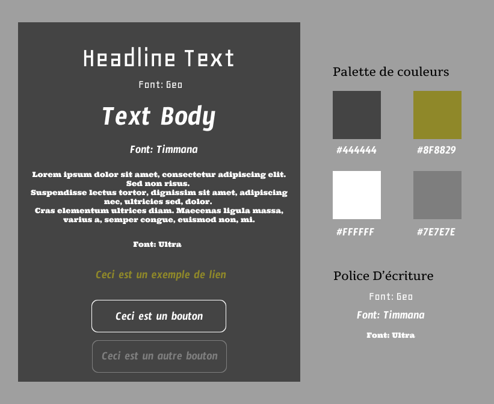

# Documentation technique concernant l'application

## Serveur :

- Fly.io
- Version PHP 8.1

## Front :

- HTML 5
- CSS 3
- Bootstrap
- JavaScript
- Twig

## Back :

- Express.js
- Node
- npm
- PostgreSQL

